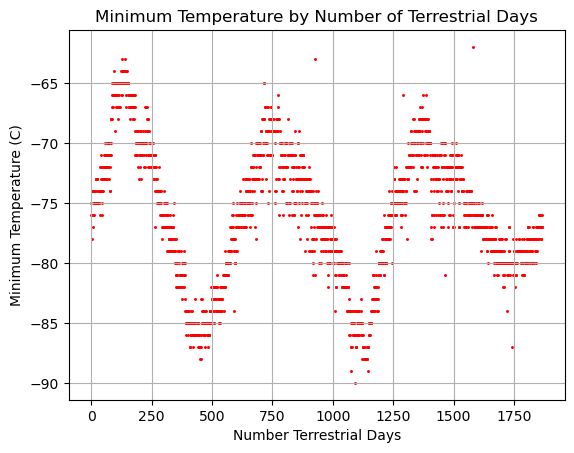

# Module 12 - webscraping-challenge

The objective of this challenge is to scrape data from a couple different websites using the Splinter function and then parsing the html data with BeautifulSoup. Each website contains Mars related information. The first website has Mars related news stories, and the goal is to scrape through the saved html and pull titles and preview text from each news story. The second website contains a table populated with Mars weather data from the Curiosity rover. The goal is to scrape the table, analyze the data, and generate various plots. 

Below is an example of plot showing the annual temperature cycle on Mars. This plot was used to estimate the number of Earth days that make up on Martian year. On the plot you can visually estimate the number of days is between 650 and 700 days. The actual number of days is 687 Earth days.

